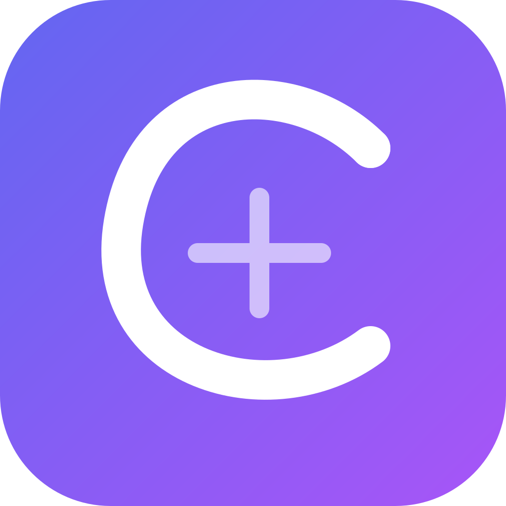
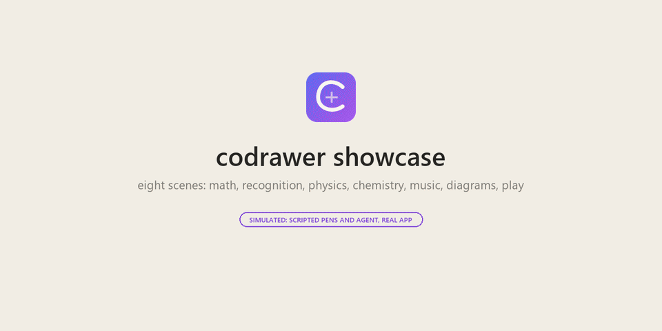

<p align="center"></p>

<h1 align="center">codrawer-bridge</h1>

<p align="center">
Stroke-native co-drawing. A reMarkable Paper Pro or reMarkable 2 streams your pen as vector strokes; glasses,
phones, browsers and agents join the same page in real time.
</p>

<p align="center">
<a href="https://github.com/Caerii/codrawer-bridge/actions/workflows/ci.yml"></a>
<a href="LICENSE"></a>
</p>

---

Most tablet tools mirror pixels: a screen stream, or an export after you save. codrawer carries
**strokes**, the way the pen made them, with pressure and timing, from the tablet's digitizer to every
participant in a session, in a few tens of milliseconds. That makes the page a shared, live object:

- **Glanceable:** your writing appears on Even Realities G2 glasses, with a loupe that follows the pen.
- **Presentable:** a phone or browser shows the page full resolution, paper or dark, for a projector.
- **Multiplayer:** other people draw onto the same page from a browser or phone, each in their own colour.
- **Agent-native:** an AI or a Claude Code session joins as a participant, sees the turn's ink and
  answers on its own layer (desktop router; see [ADR 003](docs/adr/003-agent-ink-as-governed-action.md)).

It is the hardware half of Superintelligent Group's fluid-interface plan
([`docs/sig-integration.md`](docs/sig-integration.md)).

## Tablet models

Paper Pro and reMarkable 2 use the same Go bridge, Python AI agent, native Qt
extension and G2 app. Select `CODRAWER_TABLET_MODEL=paper-pro` (the default) or
`rm2` in both the bridge and agent environments. Hardware-specific builds and
firmware validation remain separate; shared fixes belong in the common code.
See [the model support guide](docs/tablet-models.md) and
[reMarkable 2 setup](docs/remarkable2-setup.md). The existing Paper Pro release
installer remains unchanged; the rM2 installer is experimental and firmware-gated.

## What works today

| Capability | Status |
| --- | --- |
| Paper Pro pen → router → glasses and phone, live | Verified on hardware |
| Router hosted on the tablet itself (no desktop needed) | Verified on hardware |
| Bluetooth keyboard on the tablet: keystrokes streamed, replies typed back into xochitl | Verified on hardware |
| Survives reboots and OS updates (signed releases, health check, auto-rollback) | Verified on hardware |
| Pairing code for anyone joining the tablet's router | Verified on hardware |
| Tablet's saved page (`.rm` v6) streamed as a base for late joiners | Verified on hardware |
| Multiplayer participants with their own colours | Verified (browser ↔ tablet router) |
| Glasses loupe camera, follow/fit/page views mirrored between ring and phone | Verified on hardware |
| Phone camera backdrop (draw over the real world) | Built; phone testing in progress |
| Rust engine at parity with Go (1.3 MB vs 6.1 MB) | Tests and CI; Go is the default on device |
| Other participants' ink written natively into a tablet layer (XOVI) | Feasibility done, probe built, not yet run ([report](docs/investigations/native-multiplayer-layer.md)) |
| Shared markdown editor (Yjs) on the glasses | Simulator only |
| `stroke_delete`: undo / clear my strokes, agent animation | Tests (Go, Rust, app); simulator and browser |

### Showcase (a scripted simulation)

<p align="center"></p>

A 96-second tour in eight scenes: a proof that √2 is irrational checked line by line, an integral
worked by parts while a stick-figure mathematician cheers, rough shapes "recognized" and redrawn,
a ball rolling down a ramp, a water molecule cleaned up, a ball bouncing on the notes of Ode to Joy,
a flowchart walked box to box, and a finale where three people and an agent draw at once, ending on
the app's own timelapse export. [MP4](docs/media/showcase.mp4) (1280 × 640).

It is a **scripted simulation**: the pens, the agent and the recognition are
[`scripts/dev/showcase.py`](scripts/dev/showcase.py), with no model behind them, and every agent
moment is tagged as simulated in the video. What is real is everything rendered: the strokes are
ordinary protocol messages sent to the Rust router, the left screen is the glasses app in the Even
Hub simulator and the right one is a second instance of the same app in a browser. Characters move by drawing each
pose and deleting the last one with `stroke_delete`, so the lens shows them at the glasses'
2 to 4 image updates a second while the phone is smooth. Handwriting plays at 1.5 to 3× (badged),
animation in real time. Stills: [proof](docs/media/showcase-proof.png),
[music](docs/media/showcase-music.png), [together](docs/media/showcase-together.png).

### A hand for the agent

<p align="center"></p>

The agent's ink can carry the gesture of a real hand: [`packages/hand`](packages/hand/README.md)
writes text as a persona would, from a model of how people move a pen (Plamondon's
sigma-lognormal motor plans re-timed toward the two-thirds power law, a damped
shoulder–elbow–wrist–finger arm with 8–12 Hz tremor, pressure from the movement), with pauses at
phrase boundaries, a hover before a word it is unsure of, the occasional slip struck through, and
yielding while you write. Five personas (Archivist, Sketcher, Elder, Mathematician, Calligrapher)
and a Mirror that takes your pace. Watch and tune them in [`apps/hand-lab`](apps/hand-lab)
(`pnpm --filter hand-lab dev --port 5197 --strictPort`), or stream into a session with
`pnpm --filter hand cli "what if ink could travel?" --persona sketcher --ws ws://localhost:8577/ws/handlab`.
The model, its sources and the measurements: [hand simulator](docs/investigations/hand-simulator.md).

## How it fits together

```
 reMarkable Paper Pro                                  participants
 ┌──────────────────────────────────────┐
 │ pen (evdev) ─┐                       │   ws://tablet:8577/ws/<session>
 │ keyboard  ───┼─▶ bridge ─▶ router ◀──┼──────────────┬──────────────┬───────────────┐
 │ saved page ──┘   (Go or Rust)        │              │              │               │
 │ typed replies ◀──                    │        Even G2 glasses   phone / browser   desktop router
 └──────────────────────────────────────┘        (apps/even-g2)    (same app)       (AI, /term)
```

- **The bridge** reads the pen with kernel timestamps, batches points at 60 Hz, and runs an
  in-process **router**: one WebSocket session per page, bounded per-client queues, replay to late
  joiners (saved page first, then live ink). Wire format: [`docs/protocol.md`](docs/protocol.md).
- **Clients render; the router never does.** Coordinates are normalized page units, so any surface
  draws at its own resolution.
- **The glasses** cost ~200 ms per image update whatever its size, so the app sends just-in-time
  loupe frames and the full canvas after a writing lull ([ADR 006](docs/adr/006-latency-budget-per-surface.md)).
- **One page model** for every participant: the tablet's own ink, other people's, and the AI's are
  layers of the same page ([ADR 008](docs/adr/008-universal-page-model.md)).

## Quick start

You need a Paper Pro with developer mode and SSH ([`docs/remarkable_setup.md`](docs/remarkable_setup.md)),
Go 1.22+, and `pnpm`. Before installing, read
[what codrawer changes on your tablet](docs/what-codrawer-changes.md): one boot stub on the root
partition, everything else in `/home/root/codrawer`, and how to remove it all.

```bash
# 0. Where things are on your network (the scripts' defaults are the maintainer's LAN).
export CODRAWER_TABLET=<tablet-ip> CODRAWER_LAN_IP=<this-pc-ip>

# 1. Build, sign and install the bridge on the tablet (once; it then starts at every boot).
#    Generates the release key and the router's pairing code on first run.
scripts/dev/deploy-tablet.sh

# 2. Run the glasses/phone app and open a QR code that points it at the tablet.
cd apps/even-g2 && pnpm install && pnpm dev
scripts/dev/qr.sh
```

Scan the QR from the Even app (Even Hub → developer → Scan QR), or open the URL in any browser.
To install the app without a dev server, `CODRAWER_WS=ws://<tablet-ip>:8577/ws/session1 pnpm ehpk`
in `apps/even-g2` builds `codrawer.ehpk` for the Even Hub; the Even app only lets a package reach
the router origins it was built with ([details](apps/even-g2/README.md#device)). Opened without an
address, the app asks for the tablet's.

The tablet sleeps after a couple of minutes idle and drops Wi-Fi; clients reconnect on wake.
Status and recovery:

```bash
ssh root@<tablet> sh /home/root/codrawer/current/boot.sh doctor     # health, engine, OS compatibility
ssh root@<tablet> sh /home/root/codrawer/current/boot.sh rollback   # previous release
```

For AI ink and Claude Code turns, run the desktop router as well: `scripts/dev/up.sh` (see
[`CLAUDE.md`](CLAUDE.md) for ports and environment).

## Repository

| Path | What it is |
| --- | --- |
| [`bridge/remarkable/native/`](bridge/remarkable/native/README.md) | The tablet bridge and router in Go, written as literate code; start at its reading order |
| [`bridge/remarkable/rust/`](bridge/remarkable/rust/README.md) | The same bridge in Rust, at parity, selectable with `ENGINE=rust` |
| [`bridge/remarkable/boot/`](bridge/remarkable/boot) | Durable install: boot stub, signed releases, health check, rollback, Bluetooth bring-up |
| [`apps/even-g2/`](apps/even-g2/README.md) | Even G2 glasses app and phone/browser stage (TypeScript, Even Hub SDK) |
| [`packages/hand/`](packages/hand/README.md) | Handwriting simulator for agent ink: lognormal motor plans, a damped arm, tremor, personas; CLI |
| [`packages/delegate/`](packages/delegate) | Delegation on paper (ADR 012): task cards, the built-in pen grammar, consent by pen |
| [`packages/marks/`](packages/marks/README.md) | Marks that earn their meaning (ADR 013): a personal mark recogniser, the teach flow, a registry with lineage |
| [`apps/hand-lab/`](apps/hand-lab) | Watch the personas write live, with the arm, speed profiles and tunable parameters |
| [`src/codrawer_bridge/`](src/codrawer_bridge) | Desktop router (Python, FastAPI): AI worker, `/term` to Claude Code, record/replay tools |
| [`model-server/`](model-server) | OpenAI-compatible model gateway for the AI worker (Cerebras, Bedrock, Together) |
| [`codrawer-ipad/`](codrawer-ipad) | iPad client (SwiftUI + PencilKit) |
| [`scripts/dev/`](scripts/dev/README.md) | Deploy, QR, engine benchmark, keyboard and replay harnesses |
| [`docs/`](docs) | Protocol, decisions (`adr/`), device investigations (`investigations/`) |

What's next: [`docs/roadmap.md`](docs/roadmap.md) (Putnam mock-exam mode, thinking replay, marks that earn their meaning).

## Design decisions

| ADR | Decision |
| --- | --- |
| [001](docs/adr/001-turn-as-unit-of-record.md) | A turn (a submitted line and the agent's answer, with its ink) is the unit of record |
| [002](docs/adr/002-image-attachment-path.md) | How a drawing reaches the model: first as files it reads |
| [003](docs/adr/003-agent-ink-as-governed-action.md) | Agent ink is a governed action, through a codrawer MCP server, on its own layer |
| [004](docs/adr/004-terminal-session-keying-and-arbitration.md) | One shared terminal session per room, with private sessions on request |
| [005](docs/adr/005-reply-sinks-and-virtual-keyboard.md) | Where replies land (glasses, tablet via a virtual keyboard, or both) |
| [006](docs/adr/006-latency-budget-per-surface.md) | Latency budgets per surface, from measurements |
| [007](docs/adr/007-surface-composition.md) | How tablet, glasses, desktop and agents compose |
| [008](docs/adr/008-universal-page-model.md) | One page model for every participant |
| [012](docs/adr/012-delegation-on-paper.md) | Delegation on paper: task cards answered with the pen (proposed) |
| [013](docs/adr/013-marks-that-earn-meaning.md) | Marks that earn their meaning: a personal vocabulary, asked once, trusted gradually (proposed) |

Device research that shaped them, with the evidence, is in [`docs/investigations/`](docs/investigations):
xochitl's pen data and page files, durable installs across OS updates, direct BLE to the glasses,
smart_remarkable, writing native layers through XOVI, and the biomechanical hand for agent ink.

## Development

```bash
cd bridge/remarkable/native && go test ./router/ ./pen/ ./release/ ./rmlines/ ./pagewatch/
cd bridge/remarkable/rust   && cargo test
pnpm install && pnpm -r typecheck && pnpm -r test             # glasses app, hand simulator, hand lab
bash bridge/remarkable/boot/test/run.sh                       # boot scripts (Docker)
uv run pytest -q && uv run ruff check . && uv run mypy .      # desktop router
```

CI runs the Go, Rust, app, hand and boot-script suites on every push. Code is written in a literate
style: every module opens with the problem it solves and the measured facts it rests on.

Ground rules that hold across the codebase:

- **Nobody else's ink is ever overwritten.** Each participant and the AI draw on their own layer.
- **Never touch xochitl's data** except through documented, reversible paths.
- **Keep reMarkable OS updates on.** codrawer lives in `/home` and reinstalls its one boot stub.

## License

Apache License 2.0. See [`LICENSE`](LICENSE).
