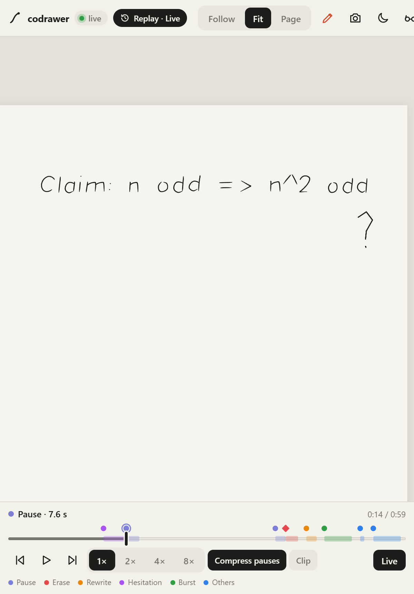
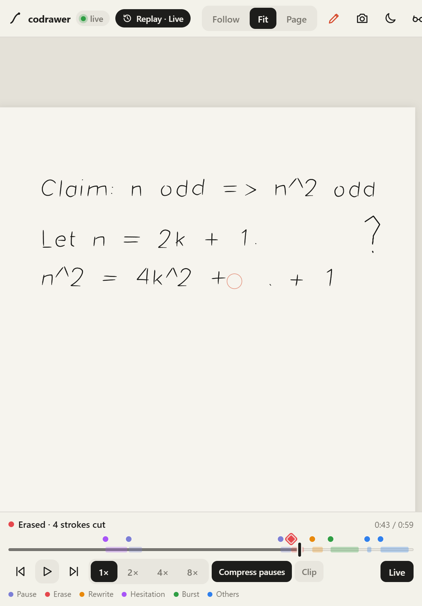

# codrawer on the Even Realities G2

Even Hub web app that mirrors a live codrawer-bridge session on the glasses: the ink is
rasterized into a 288×144 image container (the SDK's maximum) and the agent's stated
intent (`ai_intent.plan`) plus connection state go into a text container underneath.

Verified in the Even Hub simulator on 2026-09-26 (SDK 0.0.16, simulator 0.9.5).

## Run

```bash
# 1. router (port 8000 is often taken on dev machines; 8577 is the convention here)
uv run uvicorn codrawer_bridge.server.app:app --host 0.0.0.0 --port 8577

# 2. ink: a Paper Pro, the iPad app, or a looped recording
uv run python -m codrawer_bridge.tools.stroke_sim.replay_jsonl \
  --ws ws://127.0.0.1:8577/ws/session1 --in <recording>.jsonl \
  --speed 1.5 --max-gap-ms 400 --only-t-prefix stroke_

# 3. this app (port 5188; 5173 is usually held by another Vite)
cd apps/even-g2 && pnpm install && pnpm dev

# 4. simulator with the automation API
evenhub-simulator --automation-port 9898 http://localhost:5188
```

Config via query string once, then remembered in localStorage: `?ws=ws://<host>:8577/ws/session1`,
`?mode=follow|full`, `?highlight=all|user|ai`, `?window=0.22`.

When the app has no router address at all (a package built without one, opened without `?ws=`,
nothing remembered), the phone asks for the tablet's address on first run. It takes an IP
(`192.168.1.20`), `host:port`, or a full `ws://` URL, fills in the router's port (8577) and session
(`/ws/session1`), remembers the result and connects. The ⋯ menu's **Tablet address…** changes it
later. From the dev server the default is the dev server's own host.

## Editor

`/edit` (or the menu's *Edit document*) opens a full-screen editor: a real buffer with a cursor
that the view follows, wrapped at the same width as the transcript. Plain keys edit; Enter
continues markdown list prefixes; arrows, Home/End, PageUp/Down, Delete, Tab; Ctrl+Left/Right by
word; Ctrl+Home/End to the ends. `Ctrl+K` opens the command line over the document (any command,
then back), `Ctrl+S` saves and shares it with the session (`doc` message), `Ctrl+E` leaves.
A ring click in the editor saves; the ring scrolls by line.

**Shared live editing.** The document is a Yjs CRDT (`src/doc/collab.ts`): every keystroke reaches
everyone else editing the session's document within ~40 ms (`doc_update`), concurrent edits
merge without conflicts, and your cursor stays put while others type. The header shows
`live`/`offline`; edits made offline merge on reconnect, and a client that joins late gets the
document replayed by the router. The CRDT state autosaves to the WebView's and the Even bridge's
storage. A save (`Ctrl+S`, ring click, autosave) also sends a plain-text `doc` copy, which the
desktop router writes to `.codrawer/doc.md` so the terminal agent can Read it; a `/term` sent
from the editor tells the agent to read it first. A plain-text `doc` from a participant without
live editing folds in as an ordinary edit. Tests: `pnpm test`.

## Latency model and tunables

Bytes per image update are the latency budget on real glasses. Live ink therefore goes
through a small **loupe** container that follows the pen; the big **canvas** container is
refreshed only at `stroke_end` (or every `canvas_ms` during a long stroke). Frames are
latest-wins per container, throttled by the measured round trip, and image data crosses the
WebView bridge as base64 (2x faster than the SDK's default number array even in the simulator).

| Query param | Default | Effect |
| --- | --- | --- |
| `img=WxH` | `288x144` | canvas container size (max 288x144) |
| `loupe=WxH` / `loupe=0` | `128x64` | loupe size, or disable it |
| `fmt=png` / `gray8` / `gray4` | `png1` | browser PNG, or raw pixels instead of the 1-bit PNG (~4x smaller than `png`) |
| `lull_ms` | `600` | with a loupe, the canvas refreshes after this long without ink (not at every stroke_end) |
| `inflight=N` | `1` | overlapping image updates; the phone host answers `sendFailed`, keep 1 |
| `enc=b64` | `array` | base64 string imageData (the phone host rejects it; simulator/bench only) |
| `frame_ms` / `canvas_ms` | `60` / `1200` | per-container push floors (with a loupe the canvas refreshes at `stroke_end`) |
| `ai=1` | `0` | show the AI ghost layer |
| `binarize=0` | `1` | keep antialiased grey (compresses worse) |
| `eraser=<px>` | `28.8` | the tablet eraser's radius in page px: ink this close to its path is cut live, as xochitl cuts it (the Marker's eraser end at default zoom; `erase.ts`) |
| `erase=0` | `1` | no erase prediction: erased ink stays until the tablet saves the page |
| `bench=1` | | on-device benchmark: rebuilds the page per config and reports min/median ms in the HUD and console; `bench=0` returns |

The HUD status line shows `L<ms>/<count> · C<ms>/<count>`: round trip and pushes per container.

## Phone menu

The toolbar's "⋯" button opens a small menu (touch and keyboard: arrows, Home/End, Escape; a tap
outside closes it and does nothing else):

- **New drawing…** clears the page for everyone (the same as the glasses menu's *New drawing*),
  after an inline "Clear the page for everyone?".
- **My colour** picks this device's ink colour from the participant palette (remembered as
  `codrawer:color`; `?color=` still overrides). New strokes only.
- **Download page as PNG** renders the whole page at 1620×2160 on the current theme (shared
  through the share sheet on touch devices that can share files).
- **Copy invite link** copies this page's address with just `?ws=` and `?token=`, so another
  phone or browser joins the same session. Not offered in the packaged app (no address to share);
  a `localhost` router makes a link that works on this computer only.
- **Tablet address…** asks for the router address again (the same prompt as the first run) and
  reconnects to it at once.
- **Export timelapse…** opens a row of options (length 10 / 20 / 40 s; paper or dark, the current
  theme preselected) and *Record* replays the page stroke by stroke into a 1080×1440 video (720×960
  on devices reporting ≤ 2 GB of memory) that ends on a 1.5 s hold of the finished page, with a
  small "codrawer" wordmark in the corner. Strokes come in the order they were drawn, each at its
  own relative pen speed (from the points' timestamps, evenly when there are none); long pauses
  compress; the tablet's saved page, which has no times, is drawn first in file order. The frames
  are the stage's own rendering (peers keep their colours). It records in real time ("Recording…
  42%", with Cancel), as H.264 MP4 where the browser can (Safari, iOS WebViews, Chrome 126+) else
  WebM, then downloads it, or on a phone offers *Share video* (the share sheet needs a fresh tap).
  Disabled, with the reason as its tooltip, where MediaRecorder or `canvas.captureStream` is missing.
- **Replay this page** scrubs the page like a video ("show me how I got here"). The stage draws
  the page as it stood at the playhead, with the stage's own painter (peers in their colours,
  agent ink in its style, the tablet's eraser cutting ink as it did); the camera frames all the
  replay's ink, so it holds still. A bar under the stage has play/pause, previous/next stroke
  (each step shows one more stroke whole), 1× / 2× / 4× / 8×, *Compress pauses* (on: idle
  stretches over 1 s grow a tenth as fast, capped at 2.5 s; the pen keeps its own speed) and
  *Clip*. The track carries the **moments of thought** (src/replay/moments.ts), coloured by kind:
  pauses (pen up ≥ 4× the writer's median gap, within 2–4 s), erasures (eraser strokes that cut
  ink, or strokes taken back), rewrites (ink within 0.03 of just-erased ink, within 60 s),
  hesitations (strokes under half the writer's median speed), bursts (runs of ≥ 4 strokes at
  ≥ 1.5× the writer's median run rate) and other participants' or the agent's ink. Tap a marker
  to jump to it and see its caption. The saved page's strokes (no times) are on the page at 0,
  "before this session". The glasses canvas shows the replayed page too, at most every 200 ms
  (the loupe stays live). *Clip* sets a range (*Start here*, *End here*, shaded on the track) and
  exports it through the timelapse recorder: ink finished before the range is the first frame,
  the range plays at the chosen speed (3–60 s), then the hold. Leave with the toolbar's
  *Replay · Live* chip, the bar's *Live* or Escape (keys: space, ←/→, Home/End). The replay is a
  snapshot: ink arriving meanwhile shows when you go back to live.
- **Replay a recording…** does the same for a session recording (`.jsonl` from *Export
  recording*), picked from a file: strokes at their own stamps (one clock offset per sender),
  `stroke_delete` and `clear` taking ink away at their time, the first saved `page` as the base.
  `scripts/dev/replay_scene.ts` streams a scripted page with every kind of moment into a router
  for testing (`pnpm --dir apps/even-g2 exec tsx ../../scripts/dev/replay_scene.ts ws://localhost:8584/ws/replaytest`).

   
- **Record session** keeps every message to and from the router (not the router's `ping`) with
  its time, while a red dot shows in the toolbar; bounded at 50,000 messages or 32 M characters,
  past which the oldest are dropped (the count shows in the item's tooltip). Switching it on again
  starts afresh.
- **Export recording (.jsonl)** saves what was recorded in the replay tools' format, one
  `{"ts": <Unix ms>, "dir": "in"|"out", "msg": {...}}` per line, so a session replays into any router:
  `uv run python -m codrawer_bridge.tools.stroke_sim.replay_jsonl --ws ws://<router>/ws/<session>
  --in <file>.jsonl --only-t-prefix stroke_ --max-gap-ms 400` (or `scripts/dev/replay_to.py`).
- **Proof panel** shows the Primer's latest reading of a handwritten proof (ADR 010,
  `primer` in docs/protocol.md): the proof re-typeset with KaTeX (loaded on first open), each
  step's status and note, what the Primer noticed, an *estimated* Putnam score, the formal check's
  status, and its next move; *Read my proof*, *Hint* and *Download .tex*. Tapping a step picks out
  its ink on the stage (a halo under the strokes and a dashed box; tap again to clear). The *Plan*
  tab shows the weeks to the exam and the problem queue; *Learner* sets the learner name sent with
  requests (remembered as `codrawer.primer.learner`), shows mastery and what is due, and can ask
  the desktop to delete the learner's file. `?panel=proof|plan|learner` opens it at load. The
  glasses show the move's one-line `glance` on the HUD's intent line.
- **Diagnostics** (off by default: the Glasses panel here and the metrics line on the glasses) and **Dark theme** repeat the toolbar's glasses and moon buttons, which
  are hidden on phones narrower than 480 px.

- **Undo my last stroke** and **Clear my strokes** take back strokes drawn on this phone, for
  everyone, with `stroke_delete` (docs/protocol.md): the routers relay it and drop the strokes
  from their page replay, so they stay gone for late joiners. Only strokes drawn since this
  connection's `hello` count (the routers' owner is the connection); with none, both items show
  disabled with the reason as their tooltip. *Clear my strokes* shows how many there are.

Incoming `stroke_delete` removes the strokes from the glasses and the phone stage alike, whoever
sent it (an agent replacing an animation frame, another participant's undo).

## Input

Contextual menu (long-press / context gesture): Toggle AI ghost · Follow / fit page ·
Cycle emphasis · Zoom in · Zoom out. The AI toggle persists.


## Keyboard (bridged from the tablet)

A keyboard bonded to the Paper Pro arrives as `key` messages (see `docs/protocol.md`). The app
keeps a transcript in the text container: the current line shows with a cursor while you type,
Enter commits it, Backspace/Escape edit, ArrowUp/Down (or the ring in text view) scroll back.
A leading slash makes a command:

| Command | Effect |
| --- | --- |
| `/hw <text>` | AI handwrites `<text>` on the canvas (`prompt`, mode handwriting) |
| `/draw <text>` | AI draws `<text>` (`prompt`, mode draw) |
| `/new` | new drawing for every client |
| `/ai` | toggle the AI ghost layer |
| `/text` | toggle the full-screen text view (8 transcript lines; one rebuild) |
| `/clear` | clear the transcript (also Ctrl+L) |
| `/term <text>` | one instruction to the even-terminal session (router bridge) |
| `/mode term` / `/mode ink` | plain lines go to the terminal / stay local |

Typing `/` shows a completion popup; ArrowUp/Down highlight, Tab or ArrowRight completes,
Enter on a single match completes too. A pending terminal permission (`y / a / n`) or question
takes the next whole line. Rows are filled from the bottom with our own conservative wrapping
so the input line is always the last visible row.

While typing, a keystroke goes to the glasses on the key event itself, one text update in
flight at a time and always the newest line (keys typed during an update coalesce into the
next); the phone's Glasses panel echoes at once. Otherwise text falls back to the quiet 2 s
cadence so it never competes with ink. `?view=text` starts in the text view.

| Gesture | Effect |
| --- | --- |
| click | toggle follow (crop around the pen) / full page |
| double click | cycle emphasis: all → user → ai |
| scroll up / down | zoom the follow window in / out |

## Code map

Every module opens with a prose overview (what it is for, the facts it is built on, how data
flows through it); start with `src/main.ts`, which wires the rest and reads as a table of contents.
Handlers only change state and raise dirty flags; the 50 ms render loop turns flags into frames and
text and hands them to the glasses at the pace the link allows (ADR 006).

| Module | Owns |
| --- | --- |
| `main.ts` | wiring: phone setup, the router message → handler table, startup and the Even bridge |
| `config.ts` | every query parameter / remembered setting, with defaults and the measurements behind them |
| `state.ts` | the shared mutable state: stroke store, glasses view, dirty flags, ink activity, HUD, glasses device |
| `protocol.ts` | inbound router message types (docs/protocol.md) |
| `link.ts`, `reconnect.ts` | the router WebSocket: reconnect/backoff, liveness, pairing code, typed dispatcher |
| `address.ts` | a typed tablet address (IP, `host:port`, URL) → the router session URL |
| `session.ts` | ink, `page`, `clear`, `cursor`, `ai_*` → the store, the phone stage and dirty flags |
| `actions.ts` | the app's verbs (follow/fit, emphasis, zoom, AI layer, new drawing, layout switches) |
| `loop.ts` | the render loop |
| `strokes.ts` | stroke store (with each live point's time), rasterizer, loupe camera, PNG/Gray encoders |
| `erase.ts` | pure: the tablet eraser's model (radius from xochitl's thickness, cut masks) and the grid that finds the ink near it |
| `timelapse.ts`, `recording.ts` | pure: timelapse pacing (stroke order, time mapping) and the recorder format pick; the session recording's bounded log and JSONL |
| `replay/timeline.ts`, `replay/cursor.ts`, `replay/moments.ts` | pure: thinking replay: strokes (live store or recording) on one clock and the compressed axis; the page at any t as a stroke store; the moments of thought and `MomentsSummary` |
| `glasses/layout.ts` | container sets for the canvas / text / edit layouts, menu ids |
| `glasses/page.ts` | create / rebuild / retry the page, layout switches, `?probe=1`, stale-copy release |
| `glasses/input.ts` | touchpad, ring and menu events → actions |
| `glasses/display.ts` | the two drawing surfaces, loupe framing, the frame and text queues |
| `glasses/scheduler.ts` | latest-wins frame slots, just-in-time recipes, dedupe, pacing, perf stats |
| `glasses/text.ts`, `glasses/encode.ts`, `glasses/loupe.ts` | text pacing; frame encoding; loupe geometry |
| `glasses/bench.ts`, `glasses/probe.ts` | `?bench=1` and `?probe=1` |
| `hud/render.ts` | the text container's content for each layout |
| `hud/keyboard.ts`, `hud/commands.ts`, `hud/completion.ts` | key routing; what a committed line does; the `/` popup |
| `hud/terminal.ts`, `hud/transcript.ts`, `hud/wrap.ts` | even-terminal relay; the transcript; wrapping for the glasses |
| `doc/document.ts`, `doc/editor.ts`, `doc/collab.ts` | the shared document: persistence and saving; editor model; Yjs sync |
| `phone/stage.ts`, `phone/screen.ts` | the phone's full-resolution page renderer and its instance |
| `phone/toolbar.ts`, `phone/views.ts`, `phone/mirror.ts` | connection chip, theme, Glasses panel; Follow/Fit/Page and the loupe box; mirroring the ring |
| `phone/draw.ts`, `phone/camera.ts`, `phone/notices.ts` | drawing as a participant; camera backdrop; tablet notices and the pairing prompt |
| `phone/menu.ts`, `phone/invite.ts`, `phone/palette.ts` | the toolbar's "⋯" menu; invite links; participant colours |
| `phone/timelapse.ts`, `phone/recorder.ts`, `phone/share.ts` | timelapse frames and MediaRecorder, its menu row; the session recorder's link tap and toolbar dot; share sheet or download |
| `phone/replay.ts` | the replay bar: scrubber, markers, playback, the glasses canvas while replaying, clips |
| `phone/awake.ts`, `phone/devlog.ts`, `phone/panel.ts` | screen wake lock; dev console → `.codrawer/logs/phone.log`; Glasses panel status |
| `primer/model.ts`, `primer/panel.ts` | pure: the Primer's readings, the learner name, `primer_request`s; the Proof panel (KaTeX, step highlight, plan, learner) |

Tests (`pnpm test`) cover the pure modules without the SDK: the store, collab, the scheduler, text
pacing, reconnect policy, loupe geometry, view mirroring, the HUD text helpers, invite links,
the palette, timelapse pacing, the session recording's JSONL, the replay's timeline, cursor
and moments, and the Primer's readings.

## What the SDK actually does (learned in the simulator)

- Build container and update objects with the SDK classes (`new ImageContainerProperty({...})`,
  `new ImageRawDataUpdate({...})`, …); plain object literals fail the type check.
- `createStartUpPageContainer` returns `invalid` (1) if a page already exists, which is what
  happens on every HMR reload. Fall back to `rebuildPageContainer` with the same containers.
- Raw Gray8 (one byte per pixel, width × height) is accepted by `updateImageRawData`; the
  simulator renders it directly. Never overlap two image updates: chain them.
- Click arrives as a `sysEvent` **without** `eventType` (protobuf omits 0 = CLICK);
  double-click as `sysEvent.eventType = 3`; scroll up/down arrive as a `textEvent` on the
  event-capture container with `eventType` 1 / 2.
- Exactly one container carries `isEventCapture: 1`; if any container sets `zOrderIndex`,
  all must.
- The simulator's `/api/console` fills with one "Flutter Bridge intercepted" line per
  update; poll with `?since_id=` and filter for your own prefix.

## Automation

```bash
curl http://127.0.0.1:9898/api/screenshot/glasses -o shot.png
curl -X POST http://127.0.0.1:9898/api/input -H 'Content-Type: application/json' -d '{"action":"click"}'
curl 'http://127.0.0.1:9898/api/console?since_id=0'
```

## Device

Two ways onto the glasses:

- **Package** — `pnpm ehpk` builds `codrawer.ehpk`; drag it onto the Even Hub developer portal
  ("Drag and drop .ehpk file to create a project") to install it as a prototype app. The package has
  no dev server to share a host with, and the Even app only lets it reach origins listed in its
  manifest's network whitelist (enforced in the WebView; full origins only, no wildcards or ranges).
  So build it for your tablet: `CODRAWER_WS=ws://<tablet-ip>:8577/ws/session1 pnpm ehpk` starts the
  app on that router and `manifest.mjs` whitelists its origin in the package
  (`CODRAWER_WHITELIST=<url>,<url>` adds more). Built without `CODRAWER_WS`, the app asks for the
  address on first run, but only addresses whitelisted at build time (localhost, by default) can
  connect; the tracked `app.json` names no one's home network. `edition` in `app.json` is the manifest
  schema (`202601`), not a date: `evenhub pack` rejects anything else.
- **Sideload** — `VITE_HMR_HOST=<lan-ip> pnpm dev`, then `evenhub qr --url http://<lan-ip>:5188`;
  the router is assumed on the same host as the dev server.
See `docs/even-g2-testing.md`.
