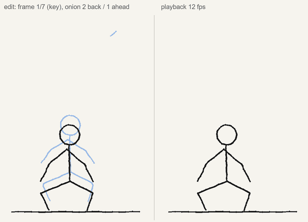
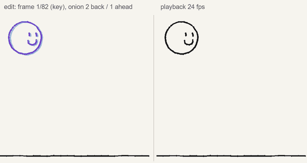

# codrawer-animate: a Flipnote-style animation studio on the Paper Pro

Status: investigation + design, with off-device spikes (2026-10-06). Branch
`research/codrawer-animate`. Related: ADR 003 (agent ink is a governed action), ADR 006 (latency
per surface), ADR 008 (universal page model), ADR 009 (call and response in native ink),
`native-multiplayer-layer.md` (the codrawer-layer XOVI extension), `latex-on-tablet.md`
(what xochitl loads, the hardware), `xochitl-pen-data.md`, `native-erase.md`, `hand-simulator.md`.

The vision this serves is on alifjakir.com/codrawer: "Draw a character, and the system can rig
it, color it, set it moving", and "the sketch *is* the program (and the program might be a story,
a creature, a machine, or a proof)". Flipnote Studio (Nintendo DSi, 2008) is the reference for
the feel: a flipbook you draw with a stylus, a strip of frames, onion skin, a few speeds, play.

**Method.** Read-only throughout. The xochitl binary on the tablet is byte-identical to the copy
studied for `native-multiplayer-layer.md` (sha256 prefix `75bbbd959d2ce324` on both, OS
3.29.0.149), so its strings, its 517 extracted QML files and its code were searched locally. On
the tablet (2026-10-06, `ssh root@192.168.50.156`) I only listed files, read the journal, sysfs
and `free`, and copied four files off with `scp` (the e-paper scene-graph plugin, the platform
plugin, this panel's waveform file and the colour tables). Nothing was installed, written,
restarted or touched on the tablet; other agents were using it. No frame rate was measured on the
panel: section 1 gives the evidence for what is possible and a probe to measure it.

## Recommendation in one paragraph

**Frames are pages.** An animation is a reMarkable notebook (one page per frame, drawn with the
real pen, natively saved, synced and undoable) plus a small codrawer document (`anim`) that adds
what a notebook lacks: per-frame hold, speed, loop mode and the frame list's identity in the
session. **Onion skin is codrawer's own QML overlay** over the page, never ink: previous frames
red, next blue (or ordered-dither grey for the fast waveform). **The tablet previews, the other
surfaces play.** The Paper Pro can show a low-rate monochrome preview through xochitl's own
`Animation` screen mode (target 4–8 fps over a region, to be measured), while the phone stage
plays at full rate, the glasses at their 3–5 fps, and export (GIF, MP4, APNG) renders from the
strokes. In-betweening, motion and physics produce **agent frames** that the animator accepts
into the notebook (ADR 003). A layer per frame is ruled out: xochitl caps a page at 5 layers.

## 1. E-ink playback on the Paper Pro

### What the display stack is (evidence)

| Fact | Evidence |
| --- | --- |
| The panel is E Ink **Gallery 3** (ACeP, four pigments) driven by a **software timing controller** (SWTCON) inside xochitl's Qt scene-graph backend | Waveform files `/usr/share/remarkable/GAL3_*.eink` (327 panel lots); xochitl's journal: `Loading waveforms from: …/GAL3_AAB04V_TD4F01_AC118TC1F2_AD1004-LHA_TC.eink` (this device, both xochitl starts today). `libqsgepaper.so` classes `EPFramebufferSwtcon`, `EPFramebufferAcep2`, `Acep2_PModeInvoker`; strings `SWTCON initialized \o/`, `swtcon(%f): generator thread has fallen behind... update=%d, next=%d`. DRM connector `card0-LVDS-1`, mode `405x1084` (packed panel timing, not the 1620 × 2160 page). |
| Four colour-mapping tables, one per waveform family: **std, best, pen, fast** | `/usr/share/remarkable/ct33_{std,best,pen,fast}.bin` (287 496 B each) and `colortable_*.bin`; loaded by `epframebuffer_acep2.cpp`. |
| Update cost depends on temperature | `EPFB_HIGHTEMP_STD_FAST_THRESHOLD`, `EPFB_HIGHTEMP_TMODE_THRESHOLD`, `temperature_hwmon: …`, `%02d: phases: %d, temp: %.1f C` |
| The renderer composes **per-region screen modes**: the debug dump lists the waveform each region gets | `libqsgepaper.so`: ` - full update, STD`, ` - full screen animation`, ` - animation .:`, ` - partial animation`, ` - mono ......:`, ` - content ...:`, ` - ui ........:`, ` - overlay ...:`, ` - pen .......:`, ` - pen (ghost):`, ` - pen (color):`, ` - pen mdither:`, ` - merged UI/Content`; `screen-mode %s [%p] sceneRect[…], mode=%d` |
| QML can ask for a mode over any item: **`Epaper.ScreenModeItem { mode: … }`** (`import xofm.libs.epaper as Epaper`, 22 files) | Enum `EPScreenModeItem::Mode` = `Pen, UI, Mono, Animation, Content, Sleep, Overlay` (binary strings + QML uses). |
| xochitl itself uses `Animation` for everything that moves | 14 uses: scrolling lists (`objectName: "scroll-container"`, active during `onMovementStarted`, kept 1 s after `onMovementEnded`), the virtual keyboard, the document drawer, combo boxes, the password field, sliders, touch input. `Content` is used for the colour pen swatches (only when `EPFramebuffer.hasCapability(EPFramebuffer.Capability.Color)`), `Mono` for a dithered swatch, `Pen` for the boot progress, `Sleep` for the sleep screen. The page canvas uses `sceneView.globalScreenMode` from a `ScreenDriver`. |
| Ghosting is managed explicitly, and is reachable from QML | `EPFramebuffer.scheduleGhostRemoval()` (used on wake), `clearGhosting`, `EPFramebuffer::GhostControlMode` = `BlinkNow, BlinkLater, BleachNow, FactoryReset`; `xofm::modules::ghostbuster`. |
| Updates can be held back and released at once | `EPRenderBlocker` (properties `deadline`, `reason`, `isBlockingUpdates`; `start()`/`stop()`); `update request blocked due to blockers`, `rendering unblocked, performing a render after`. |
| Presentation modes and capabilities | `EPFramebuffer::PresentationMode` = `Default, Mono, Magazine`; `Capability` = `None, Color, FastGrayscale`; signal `framebufferUpdated(QRect)`; property `temperature`. |
| The renderer logs its own timings, if its logging category is on | `rm.framebuffer.updates`: `update completed in %.3fms, polish=%.3fms, sync=%.3fms, render=%.3fms`; `Drawing took: %.3fms, …swap=%.3f`. Off in today's journal (no matches). |
| Hardware | 4 × Cortex-A53 at up to 1.8 GHz, 2 GB RAM, 1.3 GB available with xochitl running (`free`, `latex-on-tablet.md`). Panel 1620 × 2160. |

No `fastUpdate`, A2 or DU name appears in xochitl's QML or in the plugin: the reMarkable 2's
waveform vocabulary is gone, replaced by the screen-mode map above. The public numbers for the
panel are E Ink's announcement of Gallery 3 (2022, not measured here): about 350 ms for a
black-and-white update, and 500 ms (fast), 750 ms (standard) and 1500 ms (best) for colour. The
four `ct33_*` tables line up with those families (fast, std, best, plus pen).

### What that means for playback

- **A colour frame change is half a second or more.** The colour waveforms (`Content`, std/best)
  are for content that settles, not motion. Colour onion skin is fine (it changes once per frame
  step, while you are not drawing), colour playback on the tablet is not.
- **Motion on the tablet means the `Animation` screen mode, which is monochrome-ish.** It is what
  xochitl itself uses for scrolling and the keyboard, and the regions it names (`animation`,
  `partial animation`, `mono`) and the `pen mdither` / `Mono` swatch indicate dithered one-bit or
  few-level output. Animation frames should therefore be rendered as black ink on white with
  ordered dither for greys, which is what `packages/animate`'s `ditherKeeps` does for ghosts.
- **Small regions are cheaper.** Updates are per region (`partial animation` vs `full screen
  animation`), and SWTCON generates the waveform frames in software on the A53
  (`generator thread has fallen behind`). The player should confine itself to the animation's
  bounding box, not the page.
- **Ghosting accumulates** under fast waveforms. Stop must call `EPFramebuffer.scheduleGhostRemoval()`
  (or a `BlinkNow` ghost control) once, which is exactly what xochitl does after a sleep.
- **Realistic targets** (to be confirmed by Probe A1): tablet preview **4–8 fps** monochrome in an
  `Animation` region covering the drawing's bounding box, with visible ghosting that a stop clears;
  **1–2 fps** if it flips xochitl's own pages (each a page load plus a `Content` refresh). Full-rate
  playback happens elsewhere: the phone stage (canvas at 60 Hz), the glasses at **3–5 fps**
  (~200 ms per image send, ADR 006; the showcase's stroke-swap animation shows two to four frames a second on
  the lens), and export at any rate.
- The model encodes this: `deviceSchedule(anim, deviceFps)` keeps the animation's clock, drops
  frames a slow display cannot show, and merges repeated frames, because on e-ink a refresh that
  changes nothing still costs a waveform.

### Probes to run later (designed, not run)

Each is a command of the codrawer-layer extension, which already injects QML at run time
(`inject name=… parent=… qml=…`) and times things on the GUI thread. All are reversible (remove
the injected item) and change no notebook.

- **A1, the waveform rate probe.** Inject a panel with an `Epaper.ScreenModeItem` (mode
  `Animation`, then `Mono`, `Content`, none) over a region of 200², 600² and full-page px. A
  `Timer` flips between N prebuilt frames (a big frame counter plus a moving bar) at 40, 60, 100,
  150, 250 and 500 ms. Measure (1) in-app: connect to `EPFramebuffer.framebufferUpdated(QRect)`
  and log the interval between flips and the matching update; (2) ground truth: a 240 fps phone
  video of the panel, counting distinct counter values per second and grading ghosting after 20
  cycles and after `scheduleGhostRemoval()`; (3) colour vs black content; (4) panel temperature
  (`EPFramebuffer.temperature`). Result: a table of fps by mode × area × content, the number the
  tablet preview uses as `deviceFps`.
- **A2, the page-flip probe.** On a scratch 20-page notebook, step with the DocumentView's own
  `goToPageId` (QML function; it preloads the next and previous page, `enablePreloading`) and time
  call → `framebufferUpdated`. Tells whether "play the notebook" natively is usable at all (the
  expected answer is 1–2 fps).
- **A3, the logging probe.** With `QT_LOGGING_RULES=rm.framebuffer.updates=true` in the next
  guarded XOVI start (`boot.sh xovi on`, never by hand), read `update completed in …ms` and
  `swtcon … fallen behind` lines during A1, which separates render cost from waveform cost.

## 2. Data model

Three candidates, compared on what an animator does.

| | (a) notebook, page per frame | (b) one page, layer per frame | (c) codrawer-side document only |
| --- | --- | --- | --- |
| Drawing a frame | native pen, every tool, native undo | native, but you must keep the right layer selected | phone/agent only on the tablet unless mirrored |
| Frame strip | xochitl's page overview is already one; our strip adds holds | xochitl's layer panel | ours |
| Add / duplicate / delete / reorder | native page actions exist (`addPageAfterAction`, `DocumentController.copyPages(doc, pages, doc, index)` is duplicate, `movePages`, `deletePages`), callable from injected QML | add / delete / move layer exist | trivial |
| Onion skin | our overlay, from the neighbours' `.rm` snapshots | could show/hide layers natively (`setLayerVisible`), but onion must be faint and tinted, which a layer cannot be | our overlay |
| Playback on the tablet | page flips (slow, A2) or our player | layer visibility flips re-render the page with `Content` (slow) or our player | our player |
| **Size limit** | many pages per notebook (none hit in practice) | **5 layers per page**: `add-layer-crdt::initialize: too many layers: %d` fires when the existing count is > 4 (`cmp w2, #4; b.gt` at 0xbc928c, static disassembly, to confirm on device); our agent layer takes one | router memory |
| Sync and backup | reMarkable cloud, like any notebook; `.rm` per page | same, one file | ours (router logs, Yjs) |
| Multiplayer | other participants' strokes land natively on the frame's page via codrawer-layer (ADR 009), only on the page on screen | same, on one page | natural |
| Export | from the snapshots | same | same |
| Reversibility | uninstall codrawer: still a notebook of drawings in order | a page of 5 overdrawn layers | nothing on the tablet |

**(b) is out**: five layers make a five-frame animation. Layers stay what they are in Flipnote, a
way to separate a background from a character *within* a frame (Flipnote had two plus paper), and
xochitl's own layers do that natively.

**Recommendation: (a) for the ink, (c) for the structure.** A frame is a page in ADR 008's sense
(stable id, strokes, layers); for tablet-drawn frames its id is the xochitl page id and its strokes
are the page watcher's `page` snapshot; for phone-drawn or generated frames it is a codrawer page
(`anim:<anim id>/<frame id>`) that lives in the router until it is accepted onto the tablet (by
adding a page and committing the strokes on the frame's `codrawer:` layer, ADR 009's path). The
`anim` document holds the order, holds, fps and loop. On the tablet, **the notebook's page order is
the frame order** (`.content` `cPages`, which the page watcher already reads): reordering pages in
xochitl's overview reorders the animation, and the bridge reports it as `anim_frame` `move`s, so
there is one source of truth per fact. Holds and fps live in the `anim` document and in a small
`/home/root/codrawer/anim/<doc>.json` on the tablet, so an animation survives a router restart.

What this needs that does not exist yet:
- the page watcher reading **every** page of the animation notebook on demand (read-only, it
  already parses `.rm`), not only the open one, so the overlay and the phone have the neighbours;
- routers keeping the latest snapshot **per page id** of an animation (today: the latest `page` per
  session), bounded (a 5-stroke stick figure frame is a few KB of JSON; a dense 45-stroke page is
  169 KB, `docs/protocol.md`);
- page navigation from the extension (`goToPageId`, `addPageAfterAction`, `copyPages`), which is
  the UI automation API the extension is gaining.

## 3. Onion skin

**An overlay, not a layer.** A QML item the extension injects over the page canvas, above xochitl's
scene and below the toolbar, with no input handling (the pen goes through to xochitl). It draws the
ghosts from the neighbour frames' strokes:

- **Look.** Tint: before red `#d03030`, after blue `#1f6fe0` (the two ARGB inks Probe 1 already
  committed), opacity 0.45 for the nearest, × 0.55 per further step. Mono: the same strokes as an
  ordered 4 × 4 Bayer dither of black at that density, fixed to device pixels, so the pattern does
  not crawl between frames and survives a fast waveform. `onionGhosts` and `ditherKeeps` in
  `packages/animate/src/onion.ts` decide both (tested: exact density, nested patterns).
- **Depth.** 0–3 before, 0–2 after; default 1/1 (Flipnote shows one). Wraps in looping animations.
- **Refresh cost.** The overlay changes only on a frame step or a toggle: one `Content` refresh
  (colour) or one `Mono` refresh. While the user draws, the pen waveform renders their ink and the
  overlay does not change. The overlay's region gets its own `ScreenModeItem` (`Content` for tint,
  `Mono` for dither).
- **Placement** follows the view transform the extension already uses for agent ink
  (`sceneToViewTransform`), re-applied on pan and zoom.
- **How it paints.** QtQuick.Shapes is on disk and importable (`latex-on-tablet.md`) and suits a
  few hundred paths; a C++ `QQuickPaintedItem` in the extension, rasterising each ghost to an image
  once per frame step on a worker thread, is the predictable choice for dense frames and is also
  what the player (below) needs. Start with the painted item.
- **Why not a temporary native layer.** It would be saved, synced and undoable (wrong for a guide),
  cannot be faint or tinted per frame, costs one of the five layers, and every change would go
  through the scene's CRDT and a `.rm` write.

## 4. Flipnote features on codrawer's primitives

| Feature | How |
| --- | --- |
| Frame strip, current frame | Tablet: a compact strip in the animate panel (frame numbers, current highlighted, held frames wider); thumbnails on the phone. Navigation = `goToPageId`. |
| Add, duplicate, delete, reorder | `addPageAfterAction`, `DocumentController.copyPages`, `deletePages`, `movePages` on the tablet; `anim_frame` ops for everyone (model: `addFrame`, `duplicateFrame`, `deleteFrame`, `moveFrame`). Duplicate-then-change is the core loop and is one tap. |
| Per-frame hold | `hold` ticks (model `setHold`); no duplicate pages for holds. |
| Loop, ping-pong, once; speed | `loop`, `fps` with Flipnote's ladder plus 8 and 24 (`SPEEDS`); `passOrder`, `frameAt`. |
| Layers within a frame | xochitl's own layers (≤ 5 per page, one used by codrawer's agent layer). |
| Copy, paste, transform | xochitl's lasso already cuts, copies, pastes, moves and scales natively; pasting onto the next frame then nudging is native. "Animate this" (section 5) turns a lasso into generated frames. |
| Stamps | a stamp is a stroke set in a codrawer library; placed as agent ink at a tap (ADR 009 path). Phase 2. |
| Sound | out of scope; later a phone recording attached to the `anim` with an offset. |
| Export | **Phone**: extend the existing timelapse export (`apps/even-g2/src/timelapse.ts`, `phone/recorder.ts`, MediaRecorder → MP4/WebM) with an animation clock (`frameAt`), plus GIF/APNG encoded in the browser. **Desktop**: the router renders frames from strokes (it already renders turn PNGs for `/term`) and pipes them to ffmpeg; `packages/animate/scripts/render_gif.py` is the same idea in 100 lines. |

## 5. Intelligence

- **In-betweening (built as a spike).** Given two keys, `inbetween` (`packages/animate/src/inbetween.ts`):
  resamples strokes by arc length, matches them with the Hungarian method on mean point distance
  (forward or reversed), treats a poor match as one stroke vanishing and another appearing, and
  interpolates each pair as a near-rigid body (centroid moves, chord turns through the smaller
  angle, shape blends in the chord's frame) so a swinging limb keeps its length (tested; plain
  linear interpolation shortened it from 0.2 to under 0.15). Appearing strokes write on, vanishing
  ones retract. Spacing is a sigma-lognormal ease from `packages/hand`. Result:
  `docs/media/animate-inbetween.gif` (two keys, five in-betweens, ping-pong at 12 fps).

  

  Where it stops: occlusion, a stroke redrawn in two pieces, arcs between keys, topology changes.
  The next steps, in order of value: a *breakdown* key the animator draws in the middle (cheap,
  classical); arc paths per matched stroke from a third key; a learned model (stroke-sequence
  in-betweening, e.g. a transformer conditioned on both keys) as an agent behind `anim_tween`.
  Generated frames are agent ink (`provenance: agent`, violet in the GIF) that the animator
  accepts, edits or rejects (ADR 003).
- **Motion paths and easing.** A path is a drawn stroke; the selection follows it with an ease
  from `ease.ts` (linear, smooth, lognormal). The lognormal ease is the speed profile
  `packages/hand` already uses for a human reach, so generated motion has the same rhythm as the
  agent's handwriting.
- **Physics.** `bounce` (`motion.ts`): gravity, restitution per impact, squash on contact and
  stretch along the velocity with area kept constant (tested). `docs/media/animate-bounce.gif` is
  "animate this" on a drawn smiley ball. Next: follow-through on attached strokes (a hat lagging
  with a damped spring), wave/sway for hair and grass.

  

- **Rigging.** A drawn character becomes parts (strokes grouped by proximity and by the lasso),
  joints (where parts meet), and a skeleton fitted to them (head, torso, two arms, two legs, as the
  showcase's stick figures already are: `figure()` and the six-pose `WALK` cycle in
  `scripts/dev/showcase.py`). Each part's strokes are skinned rigidly to its bone, so a walk cycle,
  a wave or a jump is poses on the skeleton, and frames are the drawing re-posed. Phase 3; the
  agent proposes the rig as ghost bones in the overlay, the user corrects it with the pen.
- **"Animate this" on a lasso.** The dock's selection action (`ask_selection` already sends the
  lasso's bbox) gains `animate_selection`: the agent offers motions (bounce, move along a drawn
  path, wobble, spin, walk if it is a figure), generates frames, the user scrubs and accepts.
- **Multiplayer animation.** Frames are pages and every stroke has an author (ADR 008), so people
  split work by frame (each `anim_goto` shows who is on which frame in the strip) or by layer (a
  background artist and a character animator on the same frames). Only one person can be on the
  tablet; others draw on phones or iPads into codrawer frames, which the tablet user pulls in.

## 6. UI

**On the tablet** (injected QML; nothing on disk changes):

- **The dock button.** The dock gets an entry "Animate" (`dock.json` entry `animate`). In a
  notebook it toggles **animate mode** for that notebook (the notebook is registered as an
  animation the first time).
- **Animate mode** is a slim bar along the bottom edge, drawn once and refreshed only on change:
  mode indicator (a small filmstrip glyph, so the user always knows the overlay is on),
  `◀ frame 12 / 40 ▶`, a compact strip (ticks for frames, a wider tick per held frame, the
  current one filled), `+` (add after), `⧉` (duplicate), onion toggle and depth (`1|1`, `2|1`,
  off), tint/mono, play/stop, fps (tap to cycle the ladder), loop mode.
- **E-ink discipline.** No continuous animation in the UI. The bar redraws on taps only. Play
  covers only the animation's bounding box with an `Animation` screen-mode region and our player
  item (frames pre-rasterised to 1-bit images on a worker thread, flipped on the device schedule);
  stop restores the page and schedules one ghost removal. Drawing is never live while playing.
  Page turns from the side are xochitl's own, so the hardware gesture still works.
- **Memory.** A full-page 1-bit frame is 437 KB; 200 frames are under 90 MB, against 1.3 GB
  available. Cropping to the animation's bounding box usually divides that by 4–10.

**On the phone (the remote).** The phone stage gets an animate view: thumbnail strip, a scrubber
that sends `anim_goto` (the tablet turns to that frame while the user keeps the pen in hand),
full-rate playback, onion settings, in-between requests, export. Drawing on the tablet while
scrubbing on the phone is the main two-handed workflow.

**On the glasses.** Playback at 3–5 fps with `deviceSchedule(anim, 4)`, monochrome, and a one-line
status (`▶ jump 12/40 8fps`). The glasses' bench and image path are already measured (ADR 006).

## 7. Protocol additions (proposed)

Consistent with `docs/protocol.md`: JSON with `t`, normalised coordinates, ms timestamps; with ADR
008: a frame is a page, so strokes keep travelling as `page` snapshots and `stroke_*` (with the
frame's page id). Implemented as types and a reducer in `packages/animate/src/protocol.ts`
(tested); not yet in any router.

```json
{"t":"anim","id":"a1","title":"jump","fps":12,"loop":"pingpong","rev":1791262400123,
 "frames":[{"id":"f1","hold":3,"key":true,"source":{"doc":"<doc uuid>","page":"<page uuid>"}},
           {"id":"tw1","hold":1,"key":false}]}
{"t":"anim_frame","anim":"a1","op":"add","frame":{"id":"f2","hold":1},"after":"f1"}
{"t":"anim_frame","anim":"a1","op":"dup","frame":"f2","id":"f3"}
{"t":"anim_frame","anim":"a1","op":"delete","frame":"f3"}
{"t":"anim_frame","anim":"a1","op":"move","frame":"f2","to":0}
{"t":"anim_frame","anim":"a1","op":"hold","frame":"f2","hold":4}
{"t":"anim_frame","anim":"a1","op":"strokes","frame":"tw1","strokes":[{"id":"tw1/0","pts":[[0.5,0.4,0.6]],"provenance":"agent"}]}
{"t":"anim_set","anim":"a1","fps":8,"loop":"loop"}
{"t":"anim_goto","anim":"a1","frame":"f2","who":"phone-ana"}
{"t":"anim_play","anim":"a1","state":"play","at":1791262401000,"from":"f1"}
{"t":"anim_onion","anim":"a1","on":true,"before":2,"after":1,"look":"tint","who":"tablet"}
{"t":"anim_tween","anim":"a1","after":"f1","count":5,"ease":"lognormal"}
```

Rules:
- Frames are named by id, never by index; ops on unknown ids are ignored (as `stroke_delete`).
- Routers relay all of them, keep the latest `anim` per animation with structural ops applied, and
  replay it after `hello` with the frames' page snapshots.
- `anim_play` is a shared clock: every surface shows `frameAt(anim, now − at)` on its own schedule
  (`deviceSchedule`), so the tablet, the phone and the glasses stay in step without streaming
  frames.
- `anim_tween` is a request; an agent answers with `anim_frame` `add` and `strokes` ops whose
  strokes carry `provenance: "agent"`. Accepting commits them onto new pages (ADR 009 path).
- The tablet bridge emits `anim_frame` `move` / `add` / `delete` when the notebook's page list
  changes, so xochitl's own page overview stays authoritative for tablet frames.
- Later, as ADR 008 moves pages to Yjs, the `anim` structure becomes a Yjs array of frame maps in
  the same document, and these ops become its updates.

## 8. Phased plan

**Phase 1: an MVP that is genuinely fun (about 3 weeks).**
- Run probes A1 and A2 (2 days) and fix `deviceFps` from them.
- Extension: the dock's Animate entry, the animate bar, page navigation and add/duplicate through
  xochitl's own page actions, the onion overlay (painted item, tint and mono), the bounding-box
  player with an `Animation` region and ghost removal on stop (1.5 weeks).
- Bridge: read every page of an animation notebook on demand; report page-list changes as
  `anim_frame` ops; store `anim/<doc>.json` (3 days).
- Routers (Go, Rust): relay and keep `anim` and per-page snapshots for animations (2 days).
- Phone: animate view with strip, scrubber (`anim_goto`), full-rate playback, export MP4/WebM via
  the existing recorder and GIF in the browser; glasses playback (4 days).
- Risks: the `Animation` mode may be slower or ghostier than hoped (mitigation: the phone is the
  real player and the tablet preview is honest about its rate); page actions from injected QML may
  need the automation API first; xochitl restarts are a hazard (`boot.sh xovi` only, the 20 s rule).

**Phase 2: timeline UX, in-betweening, motion paths (about 3 weeks).**
- Holds and drag-reorder in the phone strip; per-frame layers view; stamps.
- `anim_tween` agent with the spike's algorithm, breakdown keys, accept/reject per frame, and
  commit of accepted frames onto new pages (needs page creation + agent ink on the new page).
- "Animate this" on a lasso: bounce, follow a drawn path, spin, wobble, with easing choices.
- Risks: correspondence fails on messy real ink (mitigation: the user draws a breakdown, or links
  strokes by tapping pairs); committing many generated frames takes ~0.3 s per page plus a page
  turn each (Probe 1 measured 314 ms per commit), so accept in a batch with a progress line.

**Phase 3: rigging, physics, multiplayer (about 5–6 weeks).**
- Rig a drawn figure (parts, joints, bones, rigid skinning), pose it, walk/run/jump cycles.
- Physics beyond the bounce: springs for follow-through, simple cloth/hair sway.
- Multiplayer: per-participant frame focus in the strip, frames drawn on phones and iPads pulled
  onto the tablet, authorship colours in the onion skin.
- A learned in-betweener behind `anim_tween`, evaluated against the geometric one.
- Risks: rig fitting to arbitrary drawings is research; multiplayer needs ADR 008's identities and
  the Yjs page model first.

## Spikes delivered on this branch

- `packages/animate` (pnpm workspace, pure TypeScript, 19 tests under tsx, typechecked):
  `model.ts` (frames, holds, loop and ping-pong, `frameAt`, `deviceSchedule`), `onion.ts` (ghosts,
  tint, Bayer dither), `ease.ts` (lognormal ease from `packages/hand`, which now exports `timing`),
  `inbetween.ts` (Hungarian correspondence, rigid-frame interpolation, write-on/retract,
  `fillBetween`), `motion.ts` (affines, bounce with squash and stretch, `animateStrokes`),
  `protocol.ts` (the `anim_*` messages and their reducer).
- `packages/animate/scripts/demo.ts` + `render_gif.py`:
  `docs/media/animate-inbetween.gif` (7 frames, 12 fps, ping-pong) and
  `docs/media/animate-bounce.gif` (82 frames, 24 fps). Left panel: the editing view with onion
  skin (two back red, one ahead blue; generated ink violet). Right: playback.

```bash
pnpm --filter animate test
pnpm --filter animate demo <dir> && uv run --no-project --with pillow python packages/animate/scripts/render_gif.py <dir> docs/media
```

## Open questions

- The actual `Animation`-mode rate and ghosting on this panel (A1), and whether the page canvas's
  `globalScreenMode` can be set to `Animation` for a page-flip preview without side effects.
- Whether `goToPageId`, `addPageAfterAction` and `copyPages` behave when called from an injected
  item rather than xochitl's own menus (the extension's automation API will answer it).
- The 5-layer cap was read from static disassembly (the comparison before
  `add-layer-crdt::initialize: too many layers`); confirm with `layers` on a scratch page.
- Whether reMarkable's cloud sync copes with notebooks of several hundred small pages as well as it
  does with ordinary ones (no reason to doubt it; not tested).

## Appendix: evidence trail (read-only, 2026-10-06)

- `sha256sum /usr/bin/xochitl` on the tablet and on the local copy: both `75bbbd959d2ce324…`.
- `strings` of xochitl (local copy): `EPScreenModeItem::Mode` and its keys, `EPFramebuffer::*`
  enums, `scheduleGhostRemoval`, `clearGhosting`, `EPRenderBlocker`, `add-layer-crdt::initialize:
  too many layers: %d`, `Invalid file, too many pages`, page actions (`copyPages`, `movePages`,
  `deletePages`, `goToPage`).
- Extracted QML (local copy): every `Epaper.ScreenModeItem` with its `mode` and `objectName`; the
  scroll container's `Animation` region with its 1 s tail; `goToPageId` with preloading;
  `duplicatePagesAction` → `DocumentController.copyPages`; the layer menu → `sceneController.addLayer()`.
- Disassembly (capstone, local copy): the function referencing the "too many layers" string at
  0xbc92d8 returns early with success when the count from its callee is ≤ 4 (`cmp w2, #4; b.gt`).
- Tablet (read-only): `/usr/share/remarkable/` listing (327 `GAL3_*.eink`, `ct33_*.bin`,
  `colortable_*.bin`), `journalctl -u xochitl` (`Loading waveforms from: …GAL3_AAB04V…`), `/sys/class/drm`
  (`card0-LVDS-1`, mode `405x1084`), `/sys/devices/platform/cumulus-panel` (PMIC rails), `free`,
  thermal zones (23–35 °C). Copied off (scp, not committed): `libqsgepaper.so`, `libepaper.so`, the
  four `ct33_*.bin`, this panel's `.eink`. The `.eink` file is not plain (it looks obfuscated), so
  phase counts per mode were not read from it.
