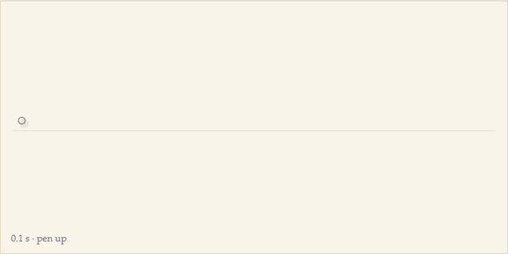
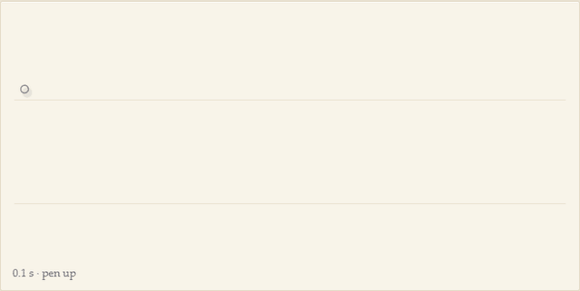
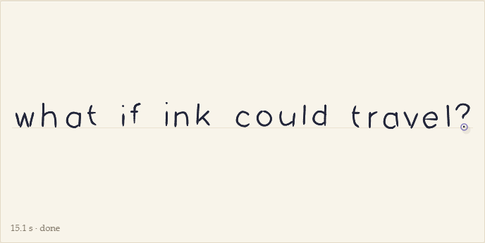
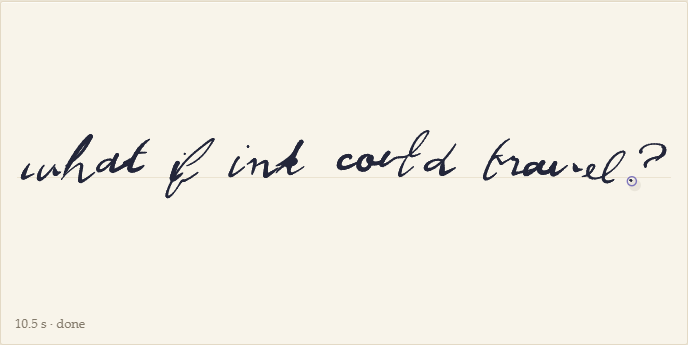
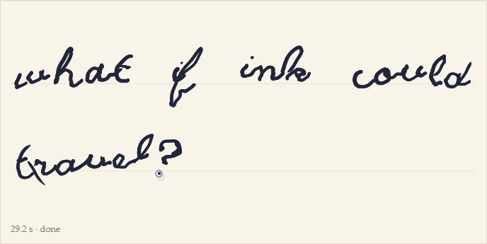
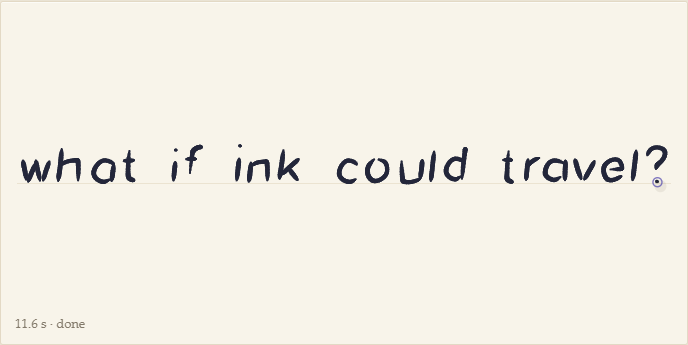
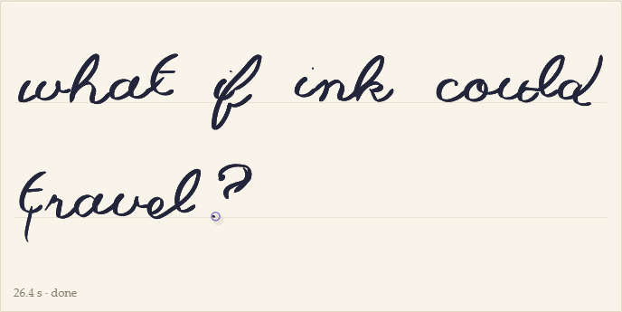

# A biomechanical hand for agent ink

Status: built (2026-10-06) · Code: `packages/hand` (simulator, CLI), `apps/hand-lab` (lab),
`apps/even-g2/src/playout.ts` (timed playback) · Related: ADR 003, ADR 008,
`docs/investigations/native-multiplayer-layer.md`

 

## Why

codrawer's premise (alifjakir.com/codrawer) is an interface that respects "the pace, texture,
and ambiguity of actual thought", with an AI co-thinker that "does not talk over you while you
are mid-thought". Stroke timing, pauses and hesitations are signal. Until now the agent's ink
had none of that: `scripts/dev/showcase.py` wrote it as Hershey glyphs with jitter and an even
pace, and the router's stub drew untimed `ai_stroke_*` points. This simulator gives the agent a
hand: personas whose strokes come from a model of how people move a pen, so the ink carries the
gesture of a real hand and its timing says something (a pause before a word the agent is unsure
of, a slip struck through and rewritten).

This is an investigation note, not an ADR: it adds a component and changes no contract. Agent
ink stays the governed action of ADR 003 (its own layer, accepted or rejected by a person); the
simulator is how `write_handwriting(text, x, y)` can render text, and its output is ordinary
`stroke_*` on the `ai` layer with real timestamps.

## The model

Text goes through eight stages, each a module of `packages/hand/src` with its sources in its
prose overview:

| Stage | Module | What it does |
| --- | --- | --- |
| compose | `compose.ts` | words → planned pen-downs with pauses, hesitation, corrections |
| layout | `layout.ts`, `glyphs.ts` | Hershey single-line skeletons in mm, per-letter drift, cursive joins |
| plan | `planner.ts`, `lognormal.ts` | skeletons → overlapping sigma-lognormal impulses and pen-up flights |
| warp | `planner.ts` | each pen-down re-timed toward the two-thirds power law |
| rehearse | `simulate.ts` | the plan run on the arm without tremor; the warp aimed further by what inertia took off |
| arm | `arm.ts`, `tremor.ts` | a damped shoulder–elbow–wrist–finger body tracks the plan at 1 kHz, with tremor |
| pressure | `pressure.ts` | from direction, speed, contact ramps, swells, a broad nib |
| sample | `simulate.ts` | pen-down points `[x mm, y mm, p, t ms]` at 125 Hz, flights between |

**Motor plan: the Kinematic Theory.** Plamondon's Kinematic Theory models a neuromuscular
system's response to one command as a lognormal speed profile, `|v(t)| = D·Λ(t; t0, μ, σ)`,
with the direction sweeping a circular arc from θs to θe (Plamondon 1995, Biol. Cybern. 72,
295–307 and 309–320; the sigma-lognormal form, Plamondon & Djioua 2006, Hum. Mov. Sci. 25,
586–607). A stroke is a sum of impulses that overlap in time. The displacement has a closed form
(the arc), so the plan is evaluated exactly rather than integrated; the tests check it against
numerical integration of the analytic velocity.

The planner works forward and simply: it places virtual targets at the path's ends, at corners
(turning more than `cornerAngle`), every `maxSweep` of turning, and at inflections; between
targets one impulse follows a circular arc that lands exactly on the next target. Durations grow
sublinearly with amplitude (isochrony: Viviani & Terzuolo 1982, Neuroscience 7, 431–437); each
command is issued before the last ends (`overlap`), less at corners and almost not at all at a
180° cusp; neuromotor noise perturbs every parameter of every impulse, so no two repetitions of
a letter match. Pen-up flights are impulses too, landing while still decelerating (the hooks at
stroke starts).

**The two-thirds power law.** Drawing obeys v = K·(R/(1+αR))^β with β ≈ 1/3 (Lacquaniti,
Terzuolo & Viviani 1983, Acta Psychol. 54, 115–130; Viviani & Schneider 1991). Summed lognormals
give a speed–curvature relation but not its exponent: measured within strokes on this planner's
output it is 0.12–0.22 on cursive text and 0.21–0.29 on drawn curves. So each pen-down is
re-timed: regress its log speed on log curvature, then stretch time (at most 2× either way, the
stroke's duration kept) to move the slope `powerLaw` of the way to −1/3; whatever speed the
curvature does not explain, the lognormal bumps, is left as it was. The arm then smooths part of
the relation away, so the plan is first *rehearsed* on the arm without tremor and the warp aimed
further by the loss (twice), the way a writer's internal model anticipates their own limb
(Wolpert, Ghahramani & Jordan 1995, Science 269, 1880–1882). The exponent is measured within
strokes (the gain K changes between movement units: Viviani & Cenzato 1985) after a 12 ms
low-pass, leaving out near-stops and each stroke's curvature extremes.

**The arm.** A planar shoulder–elbow linkage (upper arm 310 mm, forearm 255 mm) carries the
wrist pivot, the heel of the hand; the wrist rotates the hand about it and the fingers extend
the pen along the hand's axis. The forearm takes the slow part of the plan (a zero-phase
low-pass, or per-word repositioning) and the wrist and fingers the rest, mapped *linearly*, so
a long word written without moving the forearm comes out on an arc about the pivot (sagitta ≈
residual²/144 mm), the baseline arcs of real writing (division of labour after Meulenbroek et al.
1996, Psychol. Res. 59, 64–74). Each joint is a mass-spring-damper driven by an
agonist/antagonist pair whose activations set its equilibrium and stiffness (equilibrium-point
control: Feldman 1966; Bizzi et al. 1984, J. Neurosci. 4, 2738–2744), with first-order
activation dynamics (Zajac 1989) and a feedforward issued early by the activation delay.
Natural frequencies 2.5, 3.5, 9 and 11 Hz × `stiffness`, damping ratio `damping`; below ζ = 1 the
pen overshoots corners. Semi-implicit Euler at 1 kHz; ω·dt ≤ 0.2 at the stiffest setting.

**Tremor.** Physiological tremor, 8–12 Hz and tens of micrometres at the fingertip, larger and
slower with age (Elble & Koller 1990, "Tremor"; McAuley & Marsden 2000, Brain 123, 1545–1567;
Elble 1996), is band-limited Gaussian noise (a two-pole resonator) fed into the wrist and finger
equilibria and scaled by the joints' gain so that `tremor.amplitude` is the RMS at the tip; the
joints' own resonance adds the mechanical-reflex part.

**Pressure** rises on downstrokes, falls with speed, ramps in at landing and out at lift, swells
slowly for some writers, and with a broad nib follows |sin(direction − nib angle)|. It is the
regularities of pressure-tablet recordings, not a fit to data. Clients draw width from it.

**Cognitive timing.** Pauses at word, phrase and sentence boundaries, lengthening with the unit
(Matsuhashi 1981; within words, Kandel et al. 2011); the Mathematician pauses before "=" and
after the result. A per-word or per-phrase `confidence` in 0..1 adds a hover before the word
(the pen travels to the spot and waits, raised), slows the word and most of all its first
strokes, and with probability `correction·(1 − confidence)^1.5` produces a slip (a transposition,
omission or doubling) that is struck through and rewritten. "Does not talk over you" is
`perform()`: before each stroke it checks `userActive()` and, while the user writes and for a
`lull` after, it holds the pen up; later timestamps shift by the wait.

**Related work, not used.** Hollerbach's oscillation theory (1981, Biol. Cybern. 39, 139–156)
generates cursive from coupled horizontal and vertical oscillators modulated in amplitude and
phase. It produces fluent loops cheaply but has no notion of discrete commands, so pauses,
hesitations and corrections, the signal codrawer cares about, would have to be bolted on;
the lognormal plan has them at its grain. Data-driven generators (Graves 2013's RNN handwriting)
write convincingly but are a model to ship and carry no body to tune.

## Parameters and personas

A persona is data (`src/persona.ts`, typed objects; `definePersona` merges overrides onto shared
defaults), grouped by the stage that reads it: `letters` (face, join, cap height mm, slant,
spacing, per-letter jitter, baseline wander, delayed dots), `motor` (tempo, impulse duration and
size exponent, σ, overlap, sweep and corner thresholds, power-law pull, neuromotor noise), `arm`
(stiffness, damping, activation time, anticipation, carriage time and mode), `tremor`
(amplitude mm RMS, frequency, bandwidth), `pressure` (base, gain, downstroke, speed drop, swell,
nib angle and contrast, ramps) and `timing` (lift, flight, pauses, symbol pauses, hesitation,
doubt, correction rate, jitter).

| Persona | Character | 25-character line |
| --- | --- | --- |
| Archivist | upright print (futural), light even pressure, distinct strokes, low tremor, straight baseline | 15 s |
| Sketcher | slanted cursive, heavily overlapped commands, underdamped arm (loops overshoot), lazy forearm (arcs), pressure swells | 10.5 s |
| Elder | cursive with 0.085 mm tremor at 9.2 Hz, softer arm, word-by-word forearm, generous spacing, long pauses, more slips | 29 s |
| Mathematician | small crisp print, stiff well-damped arm, pauses before "=" and after results, tidy baseline | 11.6 s |
| Calligrapher | large cursive, broad nib at 40° with strong contrast, deliberate tempo, steady hand | 26 s |
| Mirror | starts from the Sketcher and moves tempo, size, pressure and lean 70 % toward the user's own (`mirror(userStats(strokes))`) | – |

| Archivist | Sketcher | Elder |
| --- | --- | --- |
|  |  |  |
| **Mathematician** | **Calligrapher** | |
|  |  | |

## Measurements (`pnpm --filter hand test`)

- Lognormal: integrating the analytic velocity reproduces the closed-form displacement to
  < 1e-4·D; its derivative matches the velocity.
- Power law at the pen tip (tremor off, within-stroke fit): drawn curves (ellipse, figure of
  eight, garland) β = 0.295–0.319 for all five personas; cursive text β = 0.287 (Sketcher),
  0.316 (Elder), 0.328 (Calligrapher). Tested within 1/3 ± 0.08. The plan aims at 0.33–0.43 to
  land there. Print personas on text measure ~0.22–0.24: their strokes are mostly straight lines,
  where the law has little to act on.
- Tremor: the generator peaks at its centre frequency with unit RMS; the difference tremor makes
  to the ink peaks at 9.28 Hz with 0.080 mm RMS for the Elder (persona 9.2 Hz, 0.085 mm) and
  9.77 Hz / 0.019 mm for the Sketcher (10 Hz, 0.02 mm).
- Determinism per seed, no NaNs, bounded coordinates, strictly increasing times, arm stability
  over stiffness 0.3–3, damping 0.1–2, activation 5–50 ms with 0.3 mm tremor, slower and more
  hesitant writing at low confidence, persona-gated corrections, the Mathematician's pauses,
  protocol batching, and the player's yielding under a virtual clock.
- Cost: a 25-character line takes ~0.3 s to simulate in Node (three arm runs at 1 kHz).

## How it reaches a session

`toProtocol(result, {origin, scale, color})` emits `stroke_begin` / `stroke_pts` / `stroke_end`
on layer `ai` with real Unix-ms timestamps, points batched every 16 ms (the bridge's rhythm),
millimetres mapped onto the Paper Pro page (179.6 × 239.5 mm, so scale 1 is true size). Any
router relays these, the tablet's Go and Rust routers included. `perform()` sends them on the
clock and yields to the user; the CLI wires it to a WebSocket and treats anyone else's strokes in
the session as the user being active:

```bash
pnpm --filter hand cli "what if ink could travel?" --persona sketcher --ws ws://localhost:8577/ws/handlab
pnpm --filter hand cli "2 + 2 = 4" --persona mathematician --out turn.jsonl  # replay_to.py
pnpm --filter hand-lab dev --port 5197 --strictPort                         # the lab
```

The phone stage (`apps/even-g2`) plays timed AI strokes at their own timing
(`src/playout.ts`): streamed live they draw as they arrive; posted in one burst they still play
back with their pauses. The glasses get each point as it arrives (one image per ~200 ms update,
ADR 006). The app shows the AI layer with `?ai=1` (or the menu). Verified end to end with the
Python router: the CLI streaming a line, and a 24 s Elder turn sent at once, both animating on
the stage. (The Python router's stub AI also answers every `stroke_end`, ours included, with its
own ellipses; the tablet's routers have no stub.)

**Native commit, later.** The tablet's codrawer-layer XOVI extension
(`docs/investigations/native-multiplayer-layer.md`) is the path for other participants' strokes
to become real xochitl strokes. The simulator's output fits it unchanged: strokes with
pressure, in page coordinates, with a tool and colour; the timing that matters on a phone or the
glasses matters less once ink is committed, but the same strokes can be committed one by one at
their pace so the page fills as if written.

## Next

- Wire `write_handwriting` in the codrawer MCP server (ADR 003) to `simulate` + `perform`, with
  the agent's own confidence per phrase.
- Replace `showcase.py`'s hand with the simulator (via the CLI's JSONL), so the showcase's agent
  ink has gesture too.
- Fit persona parameters to real Paper Pro recordings (sigma-lognormal extraction, O'Reilly &
  Plamondon 2009) instead of choosing them; a persona per user from their own strokes.
- Tilt from the arm pose (azimuth follows the forearm), for clients that draw it.
- More skeletons: a joined print face and digits/symbols drawn by hand rather than Hershey's.
- Commit strokes natively through the XOVI layer when it can write.
