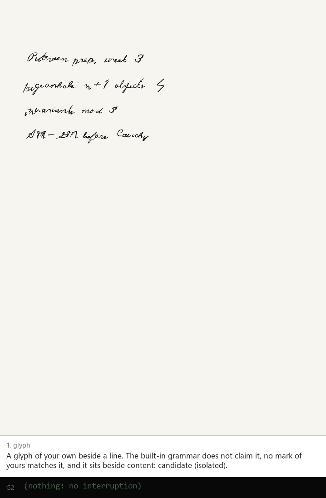

# marks

Marks that earn their meaning ([ADR 013](../../docs/adr/013-marks-that-earn-meaning.md)): the
user invents a glyph; the first time it appears beside their notes the agent asks, once and in the
page's medium, what it means; after that the mark acts, quietly confirmed at first and silently
once it has earned trust, and its meaning can always be inspected, refined or retracted.

Pure TypeScript, no DOM: it runs on the phone (`apps/even-g2`, ⋯ → *My marks*) and in Node. It
builds on [`packages/delegate`](../delegate) (gestures, geometry, the built-in pen grammar, card
layout, DTW): built-in marks first, personal marks second.

<p align="center"></p>

```ts
import { MarkEngine, withDefaults } from 'marks'

const engine = new MarkEngine({ owner: 'p_alif', send: (m) => ws.send(JSON.stringify(m)) })
engine.stroke({ id, pts /* page mm */, t0, t1, author: 'p_alif' }) // the owner's ink: recognised
engine.see(otherStroke)                                               // anyone's: context only
engine.tick(Date.now())          // settles gestures; sends mark_seen / mark_ask / mark_invoke + effects
engine.handle({ t: 'mark_define', op: 'create', by: 'p_alif', occurrence, meaning: withDefaults('flashcard'), ts }, Date.now())
```

Reading order: `cloud` ($P point clouds, $Q early abandoning, rotation search) → `context` (zone,
relation, side, target) → `recognizer` (gates, open-set thresholds, the DTW path check, negatives,
context prior) → `grammar` (built-ins first) → `actions` (the vocabulary as existing messages) →
`registry` (examples, lineage, invocations, confidence, drift, conflicts) → `teach` (candidates,
the batched ask, confirm → notify → silent) → `engine` → `protocol`.

```bash
pnpm --filter marks test       # recogniser accuracy on synthetic marks, teach flow, registry
pnpm --filter marks eval       # precision / recall table over five personas (about 35 s)
pnpm --filter marks sequence   # docs/media/marks-*.png and the GIF (needs uv for the renderer)
```

The numbers are on synthetic ink from [`packages/hand`](../hand); tuning on real Paper Pro ink is
pending (ADR 013, "Measured, on synthetic ink only").
